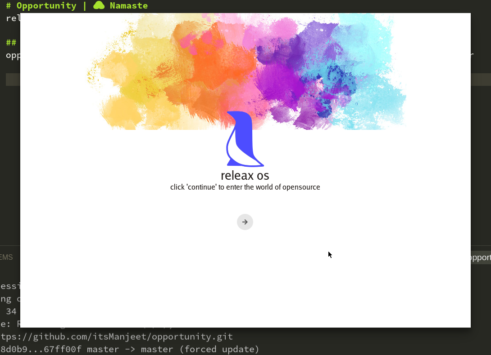
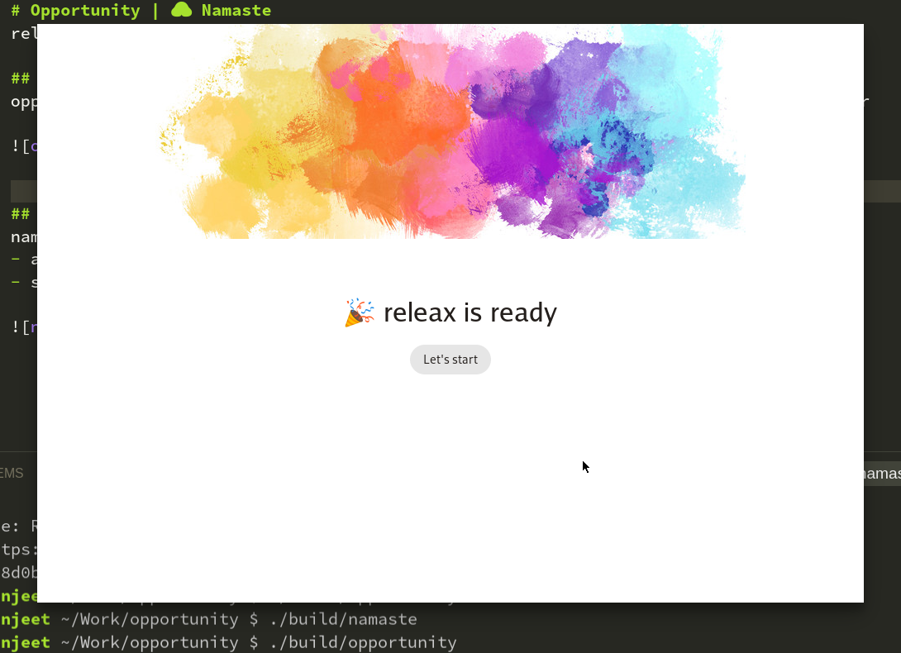

# Opportunity | 🙏 Namaste
releax os system installer and welcome app

## Opportunity
Opportunity provide interface to extract system image into disk and install bootloader

## Namaste
Namaste provide interface to configure the releax os on first boot
- add admin user
- set timezone

## Build
Compilation require releax standard base system with devkit installed
for other system:

 - gtkmm-3.0 >= 3.24
 - libr >= 0.1.0
 - project >= 0.1.0

### To compile 
   `project build <project_id>`
   
### To pack 
   `project pack <project_id>`